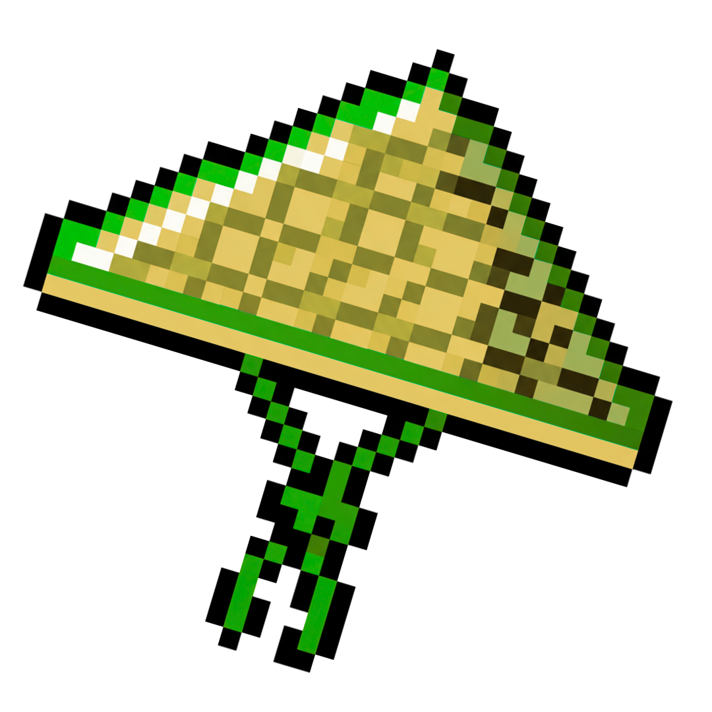

<p align="center"><a href="https://regumawar.wuaze.com/" target="_blank"></a></p>

<h1 align="center">Sistem Pertanian Terpadu (Smart Farming System)</h1>

<p align="center">
    <a href="https://github.com/URL-repositori-anda/actions"></a>
    <a href="#"></a>
    <a href="#"></a>
    <a href="#"></a>
</p>

Proyek ini adalah aplikasi web yang dibangun untuk memenuhi Ujian Akhir Semester mata kuliah Pemrograman Web Lanjut. Dengan mengacu pada tujuan SDGs ke-2 (Zero Hunger), aplikasi ini berfungsi sebagai "Sistem Pemantauan Cuaca, Berita Pertanian dan Manajemen Tanaman untuk Para Petani".

## ✨ Demo Langsung

Anda dapat mencoba aplikasi secara langsung melalui tautan berikut:

**URL:** **https://regumawar.wuaze.com/**

Gunakan akun demo di bawah ini untuk login:
- **Email:** `akuncoba@gmail.com`
- **Password:** `akuncoba`

## 📸 Tampilan Aplikasi

*(Di sini Anda bisa menambahkan screenshot tampilan utama aplikasi Anda)*
<!DOCTYPE html>
<html>
<head>
<style>
img {
  display: block;
  margin-left: auto;
  margin-right: auto;
}
</style>
</head>
<body>


</body>
</html>

## 🚀 Fitur Utama

-   📰 **Berita Pertanian:** Menampilkan berita terkini seputar dunia pertanian yang diambil langsung dari **NewsAPI**.
-   🌽 **Manajemen Tanaman:** Memantau dan mengelola data tanaman pangan (saat ini mendukung Padi dan Jagung).
-   🌦️ **Saran Berdasarkan Cuaca:** Memberikan rekomendasi pengolahan tanaman berdasarkan data cuaca real-time dari **OpenWeather API**.
-   👤 **Manajemen Akun:** Fitur lengkap untuk Registrasi, Login, serta mengubah dan menghapus akun pengguna.

## 🛠️ Teknologi yang Digunakan

-   **Backend:** PHP 8.4.1, Laravel 12.21.0
-   **Frontend:** Tailwind CSS
-   **Database:** MySQL
-   **API Eksternal:**
    -   https://newsapi.org/ untuk data berita.
    -   https://openweathermap.org/api untuk data cuaca.

## ⚙️ Petunjuk Instalasi Lokal

Untuk menjalankan proyek ini di lingkungan lokal Anda, ikuti langkah-langkah berikut:

#### 1. Prasyarat
Pastikan perangkat Anda sudah terinstal:
-   PHP >= 8.4
-   Composer 2.x
-   Node.js & NPM
-   Database (misalnya: MySQL, MariaDB)

#### 2. Langkah Instalasi

1.  **Clone repositori ini:**
    ````bash
    git clone [https://github.com/URL-repositori-anda.git](https://github.com/URL-repositori-anda.git)
    cd nama-folder-proyek
    ````

2.  **Instal dependensi Composer:**
    ````bash
    composer install
    ````

3.  **Instal dependensi NPM:**
    ````bash
    npm install
    ````

4.  **Buat file `.env`:**
    Salin file `.env.example` menjadi `.env`.
    ````bash
    cp .env.example .env
    ````

5.  **Konfigurasi file `.env`:**
    Buka file `.env` dan sesuaikan konfigurasi database Anda. **PENTING:** Masukkan juga API Key Anda dari NewsAPI dan OpenWeather.
    ````.env
    DB_CONNECTION=mysql
    DB_HOST=127.0.0.1
    DB_PORT=3306
    DB_DATABASE=nama_database_anda
    DB_USERNAME=root
    DB_PASSWORD=

    # Masukkan API Key Anda di sini
    NEWS_API_KEY=KEY_DARI_NEWSAPI
    OPENWEATHER_API_KEY=KEY_DARI_OPENWEATHER
    ````

6.  **Generate Application Key:**
    ````bash
    php artisan key:generate
    ````

7.  **Jalankan Migrasi Database:**
    Perintah ini akan membuat semua tabel yang dibutuhkan di database Anda.
    ````bash
    php artisan migrate
    ````

8.  **Compile Aset Frontend:**
    ````bash
    npm run dev
    ````
    *(Gunakan `npm run build` untuk versi produksi)*

9.  **Jalankan Server Lokal:**
    ````bash
    php artisan serve
    ````

Aplikasi sekarang seharusnya berjalan di **http://127.0.0.1:8000**.

---

## 🎓 Tugas Ujian Akhir Semester - Pemrograman Web Lanjut

Proyek ini dibuat sebagai bagian dari tugas Ujian Akhir Semester mata kuliah Pemrograman Web Lanjut.

**Institut Teknologi PLN (ITPLN)** - [https://itpln.ac.id/](https://itpln.ac.id/)

---

### Saran:
-   Pastikan path `public/img/ZeroHunger.png` benar relatif terhadap lokasi file `README.md` Anda. Jika tidak, Anda perlu menyesuaikannya.
-   Ganti `https://github.com/URL-repositori-anda` dengan URL repositori GitHub Anda yang sebenarnya pada bagian *Build Status*.

Sekarang, `README.md` Anda akan menampilkan logo web Anda dan mencantumkan backlink ke website kampus di bagian bawah.
